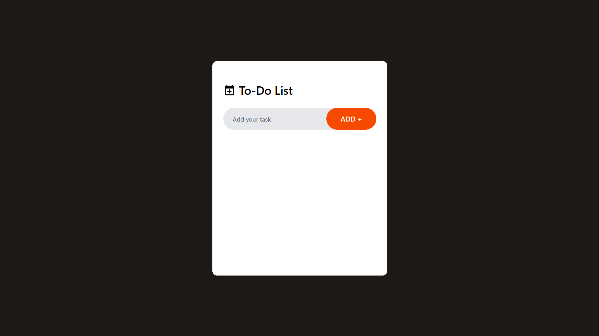
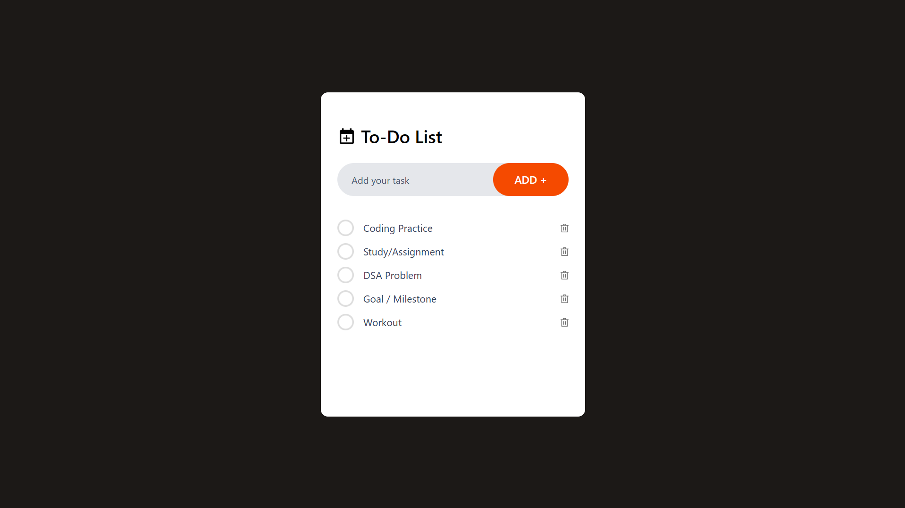
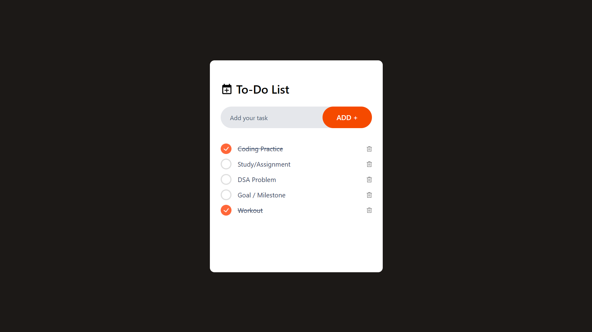
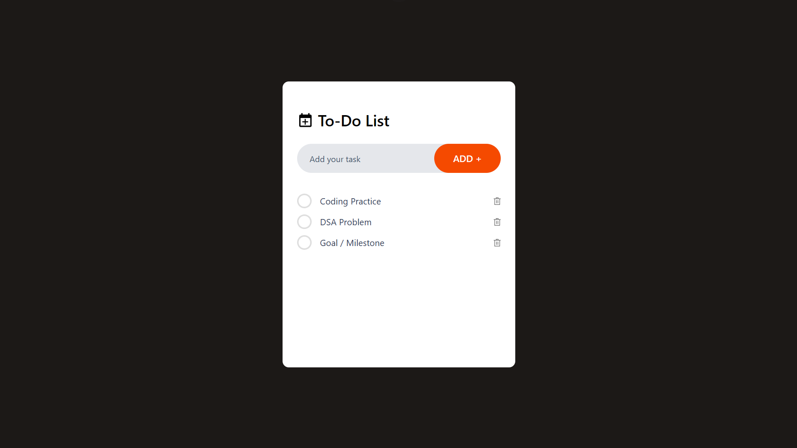

# 📝 React + Tailwind Todo App  

A simple yet powerful **Todo App** built with **React** and **Tailwind CSS**.  
It allows you to **add, mark complete/incomplete, delete tasks**, and your tasks are **saved locally** so they stay even after you refresh or close the page.  

---

## 🚀 Features  

✅ **Add Tasks** – Quickly add tasks to stay organized.  
✅ **Mark as Complete/Incomplete** – Keep track of progress.  
✅ **Delete Tasks** – Remove tasks you no longer need.  
✅ **Persistent Storage** – Tasks are saved even after a refresh (using `localStorage`).  
✅ **Responsive UI** – Works perfectly on desktop & mobile.  
✅ **Built with React + Tailwind** – Fast and beautiful design.  

---

## 🛠️ Tech Stack  

- **React** (Frontend)  
- **Tailwind CSS** (Styling)  
- **HTML & JavaScript**  
- **LocalStorage** (Persistent Data Storage)  

---

## 📸 Screenshots  
 
| Dashboard | Add Task |
|-----------|----------|
|  |  |

| Mark Task Complete | Delete Task |
|-------------------|-------------|
|  |  |


---

## ⚡ Installation & Setup  

```bash
# 1️⃣ Clone the repository
git clone https://github.com/Chetanmore4596/todo-app.git

# 2️⃣ Navigate to project folder
cd todo-app

# 3️⃣ Install dependencies
npm install

# 4️⃣ Start development server
npm run dev
```

Then open `http://localhost:5173` in your browser. 🚀  

---

## 🧑‍💻 Devloped By  

👤 **Chetan More**  
🔗 [LinkedIn](https://www.linkedin.com/in/chetan-more-b489b02a8) 
